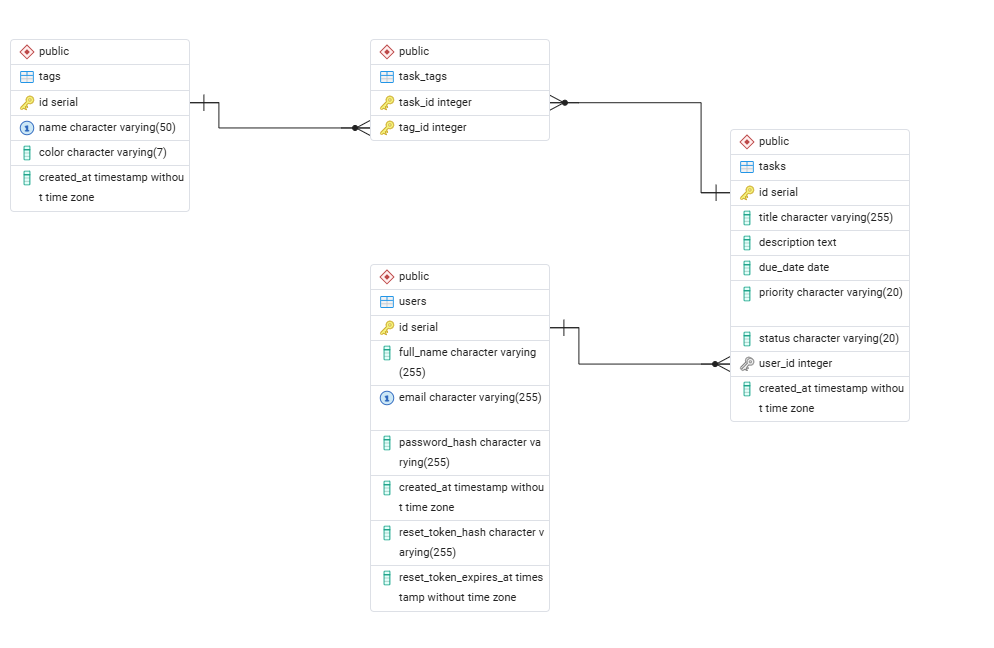

# Entity Relationship Diagram

Reference the Creating an Entity Relationship Diagram final project guide in the course portal for more information about how to complete this deliverable.

## Create the List of Tables

- users
- tasks
- tags
- task_tags

## Add the Entity Relationship Diagram

### Table: users

| Column Name | Type      | Description                     |
| ----------- | --------- | ------------------------------- |
| id          | integer   | primary key                     |
| full_name   | varchar   | user's full name                |
| email       | varchar   | user email (unique)             |
| password    | varchar   | hashed password                 |
| created_at  | timestamp | timestamp when user was created |

---

### Table: tasks

| Column Name | Type      | Description                        |
| ----------- | --------- | ---------------------------------- |
| id          | integer   | primary key                        |
| title       | varchar   | task title                         |
| description | text      | detailed description of the task   |
| deadline    | date      | due date                           |
| priority    | varchar   | task priority (high, medium, low)  |
| status      | varchar   | task status (pending or completed) |
| user_id     | integer   | foreign key referencing users.id   |
| created_at  | timestamp | timestamp when task was created    |

---

### Table: tags

| Column Name | Type    | Description                      |
| ----------- | ------- | -------------------------------- |
| id          | integer | primary key                      |
| name        | varchar | tag label (e.g. urgent, study)   |
| color       | varchar | hex color code for display       |
| user_id     | integer | foreign key referencing users.id |

---

### Table: task_tags (Join Table)

| Column Name | Type    | Description                      |
| ----------- | ------- | -------------------------------- |
| task_id     | integer | foreign key referencing tasks.id |
| tag_id      | integer | foreign key referencing tags.id  |

---

## Relationships

- **users → tasks**: one-to-many (one user has many tasks)
- **users → tags**: one-to-many (one user has many tags)
- **tasks ↔ tags**: many-to-many via `task_tags` join table (one task can have many tags, one tag can belong to many tasks)

---

### Entity Relationship Diagram

```
users
 ├── id (PK)
 ├── full_name
 ├── email
 ├── password
 └── created_at
      │
      │ 1:N
      ▼
tasks                          task_tags (join)        tags
 ├── id (PK)                    ├── task_id (FK) ──────► ├── id (PK)
 ├── title                      └── tag_id  (FK)         ├── name
 ├── description                                         ├── color
 ├── deadline                                            └── user_id (FK)
 ├── priority
 ├── status
 ├── user_id (FK)
 └── created_at
```


